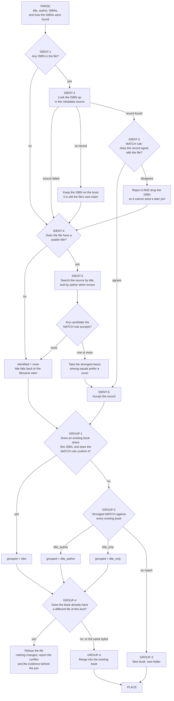
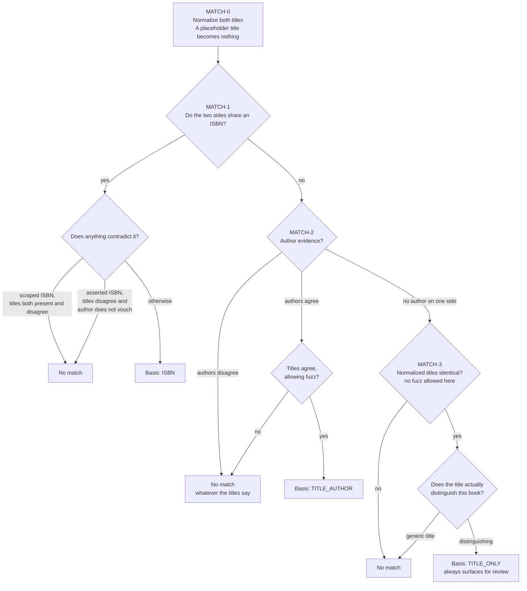

# Book identification — specification

**This document is the source of truth for identification and grouping.**
It states intent, not implementation. Every rule here is derived from a
decision record — never from reading `src/`. That is deliberate: a spec
transcribed from the code can only ever agree with the code, bugs
included, and would be worthless as a thing to check against.

So this file may legitimately disagree with what bookman does today.
That disagreement is the point, not a defect: `docs/FEATURES.md` Part I
is the conformance report against this spec, and its gap rows are the
register of where the code has not caught up. When the two disagree, the
code is what needs explaining.

*History:* this spec was written after FEATURES, and its first draft was
derived from that file's *Expected* column. Going forward the arrow runs
the other way — FEATURES rows cite the step IDs below. The `sources:`
fields still name FEATURES rows, but as **illustrative scenarios**, not
as authority; the authority is the ADR cited beside them.

**How to use it**

- *Reviewing a change to identification or grouping:* walk the steps
  below and, for each, find the code that implements it and the test that
  pins it. A step with neither is a gap; a behavior in the code with no
  step here is either undocumented intent or a bug.
- *Changing the intended behavior:* change this file **first**, with an
  ADR recording why, then the code. The `sources:` field of every step
  must keep pointing at a real decision.
- *Adding a scenario to FEATURES:* reference the step ID it exercises.

Scope: the **Identify** and **Group** stages, plus the shared match rule
they both call (ADR-9). **Parse** appears only as the input boundary and
**Place** only as the exit; those are specified elsewhere.

---

## 1. The pipeline



## 2. The match rule

One rule answers both "is this record this file's book?" and "does this
file belong in this existing folder?" (ADR-9). It is called from IDENT-3,
IDENT-5 and GROUP-1/2, and it is the only place the two questions are
decided.

Section 3 states the same rule as a table of concrete cases, which the
test suite executes against `match_basis`. The diagram says what the
rule is; that table proves the code agrees.



## 3. The decision table

Every meaningful combination of evidence MATCH can see, with the basis it
must return. This table is **executable**: `tests/test_spec_conformance.py`
parses it and runs `match_basis` against every row, so the spec proves the
code conforms rather than merely describing it.

`—` means absent. The ISBN column is how the two sides came to share an
ISBN: `asserted` from a metadata field, `scraped` from page text (ADR-14),
`—` for no shared ISBN at all.

| # | Step | File title | File author | Cand title | Cand author | ISBN | Basis | Why |
|---|---|---|---|---|---|---|---|---|
| 1 | MATCH-1 | Deep Work | Cal Newport | Deep Work | Cal Newport | asserted | ISBN | Everything agrees (A1) |
| 2 | MATCH-1 | Deep Work | Cal Newport | So Good They Can't Ignore You | Cal Newport | asserted | ISBN | Author alone vouches for an asserted ISBN (B5) |
| 3 | MATCH-1 | Dune | Frank Herbert | Dune | Kevin Anderson | asserted | ISBN | Title alone vouches for it (B5) |
| 4 | MATCH-1 | Dune | Frank Herbert | Emma | Jane Austen | asserted | none | Both contradict: the ISBN is a false positive (B5) |
| 5 | MATCH-1 | Deep Work | Cal Newport | Deep Work | Cal Newport | scraped | ISBN | A scraped ISBN is fine once the titles agree (B6) |
| 6 | MATCH-1 | Deep Work | Cal Newport | So Good They Can't Ignore You | Cal Newport | scraped | none | A citation shares its author by construction (B6) |
| 7 | MATCH-1 | Dune | Frank Herbert | — | — | asserted | ISBN | What says nothing cannot contradict (A5, A7) |
| 8 | MATCH-1 | Untitled | — | Dune | Frank Herbert | asserted | ISBN | A placeholder title cannot veto an ISBN (A12) |
| 9 | MATCH-1 | Book | Gregory Smith | Document | Jane Doe | asserted | ISBN | Nor can a generic one (A12) |
| 10 | MATCH-2 | Deep Work | Cal Newport | Deep Work: Rules for Focused Success | Cal Newport | — | TITLE_AUTHOR | Subtitle stripped by MATCH-0 (C3) |
| 11 | MATCH-2 | Introduction to Algorithms | Thomas Cormen | Introduction to Algorithm | Cormen, Thomas | — | TITLE_AUTHOR | Fuzz allowed, and "Last, First" reordered (C1, D2) |
| 12 | MATCH-2 | Book of Job | Gregory Smith | Book of Joel | Gregory Smith | — | none | Near-miss titles are different books (C9) |
| 13 | MATCH-2 | Dune | Frank Herbert | Dune | Kevin Anderson | — | none | Disagreeing authors veto, whatever the titles say (C15) |
| 14 | MATCH-2 | The Lord of the Rings Volume 1 | J.R.R. Tolkien | The Lord of the Rings Volume 2 | J.R.R. Tolkien | — | none | Fuzz must never bridge a number (C17) |
| 15 | MATCH-2 | The Book | Alan Watts | Book | Alan Watts | — | TITLE_AUTHOR | An agreeing author corroborates a generic title (A12) |
| 16 | MATCH-3 | Dune | — | Dune | Frank Herbert | — | TITLE_ONLY | Identical title, no author to cross-check it (A3, C16) |
| 17 | MATCH-3 | Introduction to Algorithms | — | Introduction to Algorithm | Thomas Cormen | — | none | No fuzz with only one signal (A3) |
| 18 | MATCH-3 | Book | — | Book | — | — | none | A generic title cannot carry a match alone (A12) |
| 19 | MATCH-3 | Untitled | — | Untitled | — | — | none | A placeholder is no title at all (A12) |
| 20 | MATCH-3 | Dune | — | Emma | Jane Austen | — | none | Different titles, nothing to corroborate (C9) |
| 21 | MATCH-1 | Deep Work | Cal Newport | The three voices of poetry | — | asserted | none | Title contradicts and no author vouches for the ISBN (B11) |
| 22 | MATCH-2 | Algorithmic Thinking, 2nd Edition | Daniel Zingaro | Algorithmic Thinking | Daniel Zingaro | — | none | A different edition is a different book (C7) |
| 23 | MATCH-2 | Algorithmic Thinking (2nd Edition) | Daniel Zingaro | Algorithmic Thinking | Daniel Zingaro | — | none | The marker survives the bracket rule (C7) |
| 24 | MATCH-2 | Algorithmic Thinking: 2nd Edition | Daniel Zingaro | Algorithmic Thinking | Daniel Zingaro | — | none | And the subtitle rule (C7) |
| 25 | MATCH-2 | Algorithmic Thinking, 2nd Edition | Daniel Zingaro | Algorithmic Thinking (Second ed.) | Daniel Zingaro | — | TITLE_AUTHOR | The same edition however it is written (C7) |
| 26 | MATCH-2 | Algorithmic Thinking, 2nd Edition | Daniel Zingaro | Algorithmic Thinking, 3rd Edition | Daniel Zingaro | — | none | Two markers must agree (C7) |
| 27 | MATCH-1 | Algorithmic Thinking, 2nd Edition | Daniel Zingaro | Algorithmic Thinking | Daniel Zingaro | asserted | ISBN | A shared ISBN with the author vouching still wins: the record is the edition (C7, B5) |

Rows are added when a rule is added, not when a bug is found — a bug means
the code disagrees with a row that already exists, which is a
`docs/FEATURES.md` Part I entry.

## 4. Normative spec

The diagrams above are the readable view; this block is the reference.
Step IDs are stable — cite them from FEATURES rows, ADRs and commit
messages.

```yaml
spec_version: 5
updated: 2026-09-20
scope: identify + group, and the match rule they share
derived_from:
  - CLAUDE.md                # project goal and scope
  - ADR-1                    # flat, title-named library; folder is identity
  - ADR-4                    # auto-lookup with a review flag, never blocking
  - ADR-9                    # one evidence-based match rule; identified/grouped/reviewed
  - ADR-10                   # the file's own title wins over the source's
  - ADR-13                   # lookups go through a MetadataSource, not a named provider
  - ADR-14                   # ISBN provenance: scraped vs asserted
  - ADR-21                   # one file per format kind; a conflicting file is refused, never overwritten
  - ADR-15                   # junk titles in two tiers
  - ADR-19                   # title disagreement vetoes an asserted ISBN unless the author vouches
  - ADR-22                   # the file's own author wins too; the record's is kept as provenance
  - ADR-23                   # a different edition is a different book; the marker survives MATCH-0
  - ADR-26                   # GROUP-1 joins on any ISBN the file carries
  - ADR-27                   # an ISBN-identified follow-up upgrades only through the joined ISBN
  - ADR-28                   # the EPUB's embedded cover when the record supplies none
  - FIELD-NOTES.md           # shapes seen in real bundles; FN-n cited where a rule came from one
# FEATURES rows named in `sources:` below are illustrative scenarios,
# not sources of authority. See the History note at the top of this file.

principles:
  - id: PR1
    rule: >
      Identification is advisory, never blocking. A weak or absent result
      is recorded and surfaced for review; it never stops an import or
      raises.
    sources: [ADR-4]
  - id: PR2
    rule: >
      One rule decides both "is this the same book as this record" and
      "is this the same book as this folder". They cannot be allowed to
      drift apart.
    sources: [ADR-9]
  - id: PR3
    rule: >
      A match must be justified by evidence, and the evidence is recorded
      by name so a frontend can explain *why* a book needs a look.
      Evidence strength, strongest first: ISBN, TITLE_AUTHOR, TITLE_ONLY.
    sources: [ADR-9]
  - id: PR4
    rule: >
      Prefer leaving a book unidentified over merging it with the wrong
      one. An unidentified book is visible in the review queue; a wrong
      merge is silent and loses data.
    sources: [ADR-9, "FEATURES gap summary"]
  - id: PR5
    rule: >
      The metadata source is a seam, not a vendor. Nothing in this spec
      may name Open Library; a second source must be addable without
      changing any rule here.
    sources: [ADR-13]

inputs:
  from_parse:
    - name: title
      note: what the file says it is called; may be absent
    - name: author
      note: may be absent, may name several people, may be a publisher or tool
    - name: isbns
      note: every valid ISBN found, normalized to ISBN-13
    - name: isbn_provenance
      values: [asserted, scraped]
      note: >
        asserted = read from a structured metadata field; scraped =
        scanned out of page text, and therefore possibly a *cited*
        book's rather than this one's.
      sources: [ADR-14, "FEATURES B6"]

steps:

  - id: MATCH-0
    stage: match
    does: Reduce both titles to a comparable form before anything else.
    rules:
      - Normalize Unicode form and case.
      - >
        Lift out an *edition marker* first, before anything below can
        discard it: an ordinal followed by "edition" or "ed." — "2nd
        Edition", "Second Edition", "2nd ed.", wherever it sits in the
        title and however it is set off (comma, colon, brackets, or
        nothing). It is reduced to a number and put back at the end of
        the normalized title, where the number rule of MATCH-2 applies
        to it: two titles that both carry a marker must carry the same
        one, and a title that carries one does not agree with one that
        does not. A different edition is a different book (ADR-23), and
        an unmarked title is not assumed to be the first edition.
      - Drop a subtitle introduced by ":", ";", a spaced dash, or an em/en dash.
      - Drop a trailing parenthesized or bracketed group (other edition notes).
      - Drop a leading English article.
      - Strip punctuation and collapse whitespace.
      - >
        A *placeholder* title names no book — "Untitled", "Untitled
        Document 2", "No Title", or a converter's filename stamp such as
        "Microsoft Word - chapter1.docx". It reduces to nothing and from
        here on is treated exactly as a missing title.
    sources: [ADR-9, ADR-15, ADR-23, "FEATURES C1-C8", "FEATURES C11", "FEATURES C13", "FEATURES A12"]
    unspecified:
      - >
        Edition markers without an ordinal — "Revised Edition",
        "Expanded Edition", "Anniversary Edition", "2e" — are not
        recognized. They fall to the subtitle and bracket rules like any
        other words, so a bracketed or colon-separated one is dropped
        and the titles may then agree. None has been seen in a bundle;
        add the shape when one is.
        sources: ADR-23
      - >
        A *series prefix* ("The Expanse 1: Leviathan Wakes") is not
        stripped. The subtitle rule above removes what follows the
        colon, so the prefix is what survives and the volume title is
        what is lost. No rule here fixes that; the effect is a book
        left unidentified, never a wrong merge, so it is a missing
        cover rather than a defect.
        sources: FEATURES C10
      - >
        A very long title is passed to search unchanged. Nothing here
        requires a second search on the normalized short title.
        sources: FEATURES C12

  - id: MATCH-1
    stage: match
    question: Do the two sides carry the same ISBN?
    outcomes:
      - when: no shared ISBN
        then: continue to MATCH-2
      - when: shared ISBN, and the ISBN was scraped from page text
        then: >
          Reject if both titles are present and disagree — a citation
          shares its author by construction, so the author cannot vouch
          for a scraped number. Otherwise the basis is ISBN.
        sources: [ADR-14, "FEATURES B6"]
      - when: shared ISBN, and the ISBN was asserted in a metadata field
        then: >
          Reject if the titles disagree and the author does not vouch
          for the number -- that is, the author disagrees or is absent
          on either side. An agreeing author rescues a title mismatch,
          because a shared ISBN is a strong prior; but a title that
          contradicts with nothing to answer it is a record of some
          other book.
        sources: [ADR-9, ADR-19, "FEATURES B5", "FEATURES B11"]
      - when: shared ISBN, and there is no real title on one side
        then: >
          The basis is ISBN. A missing title — including a placeholder or
          a merely generic one — says nothing, and what says nothing
          cannot contradict.
        sources: [ADR-14, ADR-15, "FEATURES A5", "FEATURES A7"]

  - id: MATCH-2
    stage: match
    question: What does the author evidence say?
    rules:
      - Two authors agree when they name at least one person in common.
      - >
        Reorder "Last, First"; ignore accents, initials, generational
        suffixes ("Jr.", "III") and placeholder names that identify
        nobody ("Anonymous", "Unknown", "Various"). A name that is only
        a placeholder is no author.
      - Several authors may be listed; sharing one of them is agreement.
    outcomes:
      - when: authors disagree
        then: No match, whatever the titles say. This is the strongest veto in the rule.
        sources: [ADR-9, "FEATURES C15", "FEATURES D6"]
      - when: authors agree and the titles agree, allowing fuzz
        then: Basis is TITLE_AUTHOR.
        sources: [ADR-9, "FEATURES A2", "FEATURES F3"]
      - when: authors agree but the titles do not
        then: No match.
        sources: ["FEATURES C9"]
      - when: an author is missing or a placeholder on either side
        then: No author evidence either way; continue to MATCH-3.
        sources: [ADR-9, "FEATURES A9", "FEATURES D8"]
    notes:
      - >
        Fuzz must never bridge a difference in numbers: "Volume 1" and
        "Volume 2" are different books however long the shared prefix.
        sources: ADR-9, FEATURES C17, C18
      - >
        An edition difference is likewise a different book: MATCH-0
        turns an edition marker into a number token, so this rule
        keeps "2nd Edition" apart from "3rd Edition" and from an
        unmarked title the same way it keeps volumes apart.
        sources: ADR-23, FEATURES C7

  - id: MATCH-3
    stage: match
    question: With no author evidence, do the titles alone justify a match?
    rules:
      - >
        Require the normalized titles to be *identical*. No fuzz — with
        only one signal there is nothing to cross-check it against.
      - >
        Require the title to actually distinguish this book. A merely
        *generic* title — "Book", "Document", "Final Draft" — could be
        real, so it is not discarded outright like a placeholder, but it
        cannot carry a match by itself. It needs a corroborating author,
        which by definition this branch does not have.
    outcomes:
      - when: identical and distinguishing
        then: Basis is TITLE_ONLY. Always surfaces for review.
        sources: [ADR-9, "FEATURES A3", "FEATURES C16", "FEATURES F4"]
      - when: identical but generic
        then: No match.
        sources: [ADR-15, "FEATURES A12"]
      - when: not identical
        then: No match.
        sources: [ADR-9, "FEATURES C9"]

  - id: IDENT-1
    stage: identify
    question: Does the file carry an ISBN?
    outcomes:
      - when: none
        then: Go to IDENT-4.
      - when: one or more
        then: >
          Try them in turn at IDENT-2 until one is accepted. A file can
          legitimately carry the print and ebook ISBNs, or a list of
          cited ones; the first is not privileged.
        sources: ["FEATURES A10"]

  - id: IDENT-2
    stage: identify
    does: Ask the metadata source for the record behind an ISBN.
    outcomes:
      - when: the source errs, times out, rate-limits or returns malformed data
        then: >
          Treat as "no record" and carry on. A lookup failure must never
          raise out of an import or degrade what is already known.
        sources: [PR1, "FEATURES E9", "FEATURES E10", "FEATURES E13"]
      - when: the source has no record for the ISBN
        then: >
          Keep the ISBN on the book — it is the file's own claim, and the
          source not knowing it proves nothing — then fall through to
          search.
        sources: ["FEATURES B7", "FEATURES E3"]
      - when: a record comes back
        then: Go to IDENT-3.

  - id: IDENT-3
    stage: identify
    does: Cross-check the record against what the file says about itself, via MATCH.
    outcomes:
      - when: MATCH agrees
        then: Accept it (IDENT-6) with basis ISBN.
        sources: ["FEATURES A1", "FEATURES E1"]
      - when: MATCH disagrees
        then: >
          Reject the record *and* discard the ISBN, so a false positive
          cannot later seed an ISBN-based join. Then fall through to
          search.
        sources: [ADR-9, "FEATURES B5", "FEATURES B6", "FEATURES B10", "FEATURES E2"]

  - id: IDENT-4
    stage: identify
    question: Is there a title worth searching on?
    outcomes:
      - when: no title, an empty one, or a placeholder
        then: >
          Do not search — there is nothing to search for, and a junk
          query returns junk. Identification ends with nothing;
          the title falls back to the filename stem for naming purposes.
        sources: [ADR-15, "FEATURES A4", "FEATURES A8", "FEATURES A11", "FEATURES A12"]
      - when: a usable title
        then: >
          Search by title, and by author when the file names one. A
          generic title still counts as usable: searched together with an
          author, it is how such a book gets identified at all.
        sources: [ADR-15, "FEATURES A2", "FEATURES A3"]

  - id: IDENT-5
    stage: identify
    does: Choose among the candidates the search returns.
    rules:
      - Candidates are proposals; each must pass MATCH on its own.
      - Relevance order does not decide — a later candidate may win.
      - The strongest basis wins.
      - Among candidates of equal basis, prefer one that has a cover.
      - A stronger basis beats a weaker one that has a cover.
    outcomes:
      - when: no candidate passes MATCH
        then: Identification ends with nothing; the file's own metadata stands.
        sources: ["FEATURES E4"]
      - when: one is accepted
        then: Accept it (IDENT-6) with its own basis.
        sources: ["FEATURES E5", "FEATURES E6", "FEATURES E7"]

  - id: IDENT-6
    stage: identify
    does: Apply an accepted record to the book.
    rules:
      - >
        The title stays the file's own. Acceptance has already
        established the two agree, and the file carries the publisher's
        spelling while the source's is crowd-sourced. The record's title
        is used only when the file has none.
        sources: ADR-10, FEATURES E14, FEATURES A7
      - >
        The author stays the file's own as well, whatever the basis. The
        argument is the title's, plus one of its own: a match that
        corroborated the author has by definition checked the file's
        against the record's, so replacing it gains nothing — and loses
        something, because the source's author list is in practice
        *work*-level, the union across every edition, which can promote
        an audiobook's narrator to co-author, and the source carries no
        role field a rule could filter on. The file names who wrote
        *this* edition. The record's author is used only when the file
        has none.
        sources: ADR-22, FEATURES D13, FEATURES A6, FEATURES E8
      - >
        A file author that is only a stand-in for a missing value —
        "Unknown", "N/A" — is no author here: it is filled from the
        record, not kept. "Anonymous" and "Various" are not stand-ins;
        they say something true about the book and stand like any other
        author. (Both kinds are equally *no evidence* at MATCH-2; the
        distinction is only about what is worth keeping.)
        sources: ADR-22, FEATURES A9, FEATURES D14
      - >
        The record's author is kept beside the book's own, as
        `record_author`, so a frontend can show what the source says and
        offer it as the alternative spelling. It is provenance, not a
        second opinion: a difference between the two does not surface
        the book for review.
        sources: ADR-22, FEATURES I12
      - >
        The cover comes from the record. A record with no cover is still
        a valid identification; a failed cover download still leaves the
        book cataloged.
        sources: FEATURES E11, FEATURES E12
      - >
        When the book has no cover after that — no record, a record
        without one, or a download that failed — and the file is an EPUB
        with an embedded cover image, that image is the cover. It is the
        publisher's own picture of this very edition, so it is never
        wrong; it ranks below the record's only because the record's is
        the one a later, stronger identification will replace it with,
        and a book should not flip between two pictures. A book that
        already has a cover keeps it.
        sources: [ADR-28, "FEATURES E15", "FIELD-NOTES FN-5"]

  - id: GROUP-1
    stage: group
    question: Does an existing book share one of this file's ISBNs?
    rules:
      - >
        A shared ISBN is not sufficient on its own. Run the same MATCH
        rule before joining, exactly as identification does — otherwise
        one false-positive ISBN in two unrelated files merges them.
      - >
        *Every* ISBN the file still carries is a candidate for the join,
        not only the one identification settled on. A copyright page
        lists the print and ebook numbers together, and the companion
        EPUB asserts the ebook one; identification may well have accepted
        the print one first (IDENT-1: the first is not privileged). An
        ISBN rejected at IDENT-3 is not carried and so cannot join.
        sources: [ADR-26, "FIELD-NOTES FN-4"]
    outcomes:
      - when: a book shares one of the ISBNs and MATCH confirms it
        then: Join it. grouped = isbn. This beats any title-based candidate.
        sources: ["FEATURES F2", "FEATURES F5", "FEATURES B10", "FEATURES F17"]
      - when: otherwise
        then: Go to GROUP-2.

  - id: GROUP-2
    stage: group
    does: Run MATCH against every existing book and take the strongest result.
    rules:
      - TITLE_AUTHOR beats TITLE_ONLY.
      - Ties resolve deterministically, by sorted folder order, so imports are repeatable.
    outcomes:
      - when: a TITLE_AUTHOR match
        then: Join it. grouped = title_author.
        sources: ["FEATURES F3"]
      - when: only TITLE_ONLY matches
        then: Join the first. grouped = title_only, and the book surfaces for review.
        sources: ["FEATURES F4", "FEATURES F6", "FEATURES C16"]
      - when: nothing matches
        then: Go to GROUP-3.

  - id: GROUP-3
    stage: group
    does: Treat this as a new book and claim a new folder for it.
    rules:
      - grouped stays unset — there was no join to record.
      - identified is whatever the identify stage concluded.
    sources: ["FEATURES F1", ADR-1]

  - id: GROUP-4
    stage: group
    does: Merge a file into the book it joined.
    rules:
      - >
        A book holds at most one file per format kind. A file whose kind
        the book already has is **refused** unless it is byte-for-byte the
        file already there (which is a re-import, below). Refusing changes
        nothing — not the folder, not the catalog, not the book's evidence
        — and reports the conflict with what a person needs to resolve it:
        the book that was joined, the file it already holds, the basis of
        the join (an ISBN join says "same book, which file?"; a title-only
        join says "was this even the same book?"), and what the incoming
        file resolved to. The resolution itself — replace the file, or
        import it as a separate book — is the user's decision and is not
        specified here; nothing is ever overwritten to save them making it.
        sources: ADR-21, FEATURES F14
      - >
        grouped records the *weakest* join ever used, not the latest. A
        doubtful join stays visible even after a later confident one.
        sources: FEATURES F10
      - >
        Identification never downgrades. A follow-up format that
        identifies more weakly, or whose lookup failed, changes nothing.
        sources: ADR-4, FEATURES F8
      - >
        A follow-up that identifies more strongly upgrades the book's
        metadata and cover.
        sources: FEATURES F7
      - >
        Except on an ISBN join: a follow-up identified *by ISBN* upgrades
        the book only when its record was reached through the ISBN the
        join was made on — the book's own. A record reached through
        another of the file's ISBNs may describe a different edition (a
        copyright page cites the previous ones), and a file with no
        title of its own cannot tell. Such a follow-up is grouped, and
        fills blanks, but the book keeps its title, cover and
        `identified`.
        sources: [ADR-27, "FEATURES F18", "FIELD-NOTES FN-4"]
      - >
        On *equal* evidence the first spelling of the title stands, so
        equally-identified formats do not take turns rewriting it.
        sources: ADR-10, FEATURES F9
      - >
        A book a human has reviewed is left alone: their title, author,
        ISBN and cover survive any later import.
        sources: ADR-9, FEATURES F11
      - >
        Except that a TITLE_ONLY join clears the reviewed flag. The
        review covered a state, and a doubtful change to that state
        deserves a second look — without overwriting anything the human
        set.
        sources: ADR-9, FEATURES F12
      - >
        Re-importing the same file is idempotent: one format entry, the
        file replaced. "The same file" means the same bytes, judged
        against the file already in the folder — no stored provenance is
        needed to tell it from a different file of the same kind.
        sources: FEATURES F13, ADR-21
      - >
        Import order must not change the end state: the same set of files
        in any order yields the same book.
        sources: FEATURES F16

review_queue:
  rule: >
    A book is surfaced for review when the evidence behind it is weaker
    than a corroborated match — that is, when nothing identified it, or
    when its identification or any join rested on a title alone. The flag
    is derived from the recorded evidence rather than stored as an
    opinion, so a frontend can always say *why*.
  sources: [ADR-4, ADR-9, "FEATURES A3", "FEATURES A8", "FEATURES C16", "FEATURES E4", "FEATURES F4"]

decided_questions:
  - id: OQ1
    ref: FEATURES F14
    question: >
      Two different files of the same format kind for the same book — two
      EPUB editions. Reject the second, keep both as versions, or accept
      and report it?
    decided: 2026-09-18, ADR-21 — reject, and report why (GROUP-4, first rule).
    note: >
      Was thought blocked on stored per-file provenance (I11). It is not:
      the existing file is in the folder, so "same bytes or not" is
      answered by comparing against it. Keeping both as versions was
      rejected because it breaks one-file-per-kind (the model, the folder
      layout and the TUI all assume it) and leaves a wrong merge holding
      two files; accept-and-report because the first file is still gone.
      Deliberate replacement and "import as a separate book" are the
      follow-ups, FEATURES K11/K12.

  - id: OQ3
    ref: FEATURES C7
    question: >
      Is a different edition of a book a different book? "Algorithmic
      Thinking, 2nd Edition" and "Algorithmic Thinking" did not match,
      but only because the comma left the marker in place — bracketed
      and colon-separated markers were stripped by MATCH-0 and the
      editions then merged.
    decided: 2026-09-19, ADR-23 — yes, a different edition is a different book (MATCH-0's edition rule).
    note: >
      Forced by the model as much as chosen: one file per kind (ADR-21)
      means two editions each with an EPUB cannot share a folder, and
      editions carry their own ISBNs and covers. Separate-when-wrong is
      two folders side by side; merged-when-wrong is a lost file or a
      bogus conflict (PR4). Grouping editions under one book with an
      edition field (I7) would need per-edition file slots — not v1.0.
      Cost accepted: a marked title does not agree with an unmarked one,
      so an edition file whose companion PDF carries a bare title only
      groups via a shared ISBN, and identifies via search only when the
      record's title carries the marker too.

open_questions:
  - id: OQ2
    ref: FEATURES B7 + I12
    question: >
      An ISBN that was scraped from page text and is unknown to the
      source is kept on the book, but nothing records that it was
      scraped. GROUP-1 therefore cannot apply the stricter scraped-ISBN
      rule that IDENT-3 applies.
    blocked_on: persisting ISBN provenance on the book — FEATURES I12.
    status: known divergence between IDENT-3 and GROUP-1, accepted for now.
  - id: OQ4
    ref: FIELD-NOTES FN-4, FEATURES F16
    question: >
      A book remembers one ISBN, the one its first file was identified
      by. GROUP-1 now compares every ISBN the *incoming* file carries
      against it (ADR-26), which joins a PDF (print + ebook numbers
      scraped) to the EPUB (ebook number asserted) — but only in that
      order. PDF first, the book holds the print number and the EPUB's
      ebook number never meets it; the pair then falls to the title
      rule and, across an edition marker, splits. So GROUP-4's
      order-independence rule does not hold for this shape.
    blocked_on: >
      remembering every ISBN a book's files claimed (a Book/metadata
      change), which would also carry the provenance OQ2 wants. Decide
      once more bundles show whether EPUB-first is the common case.
    status: open; ADR-26 chose the narrow rule for v1.0.

```
